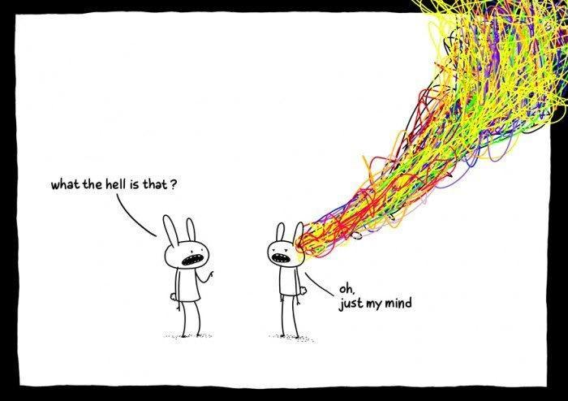

Today, I talked with Thanadol Chomphoochan (Aqua). For some reason, we decided to talk about college essays and came up with this huge list of reflective questions. Whatever comes up in your mind counts. There is no wrong answer. Enjoy pondering, high schoolers.

1.  How many language and/or dialects do you speak? Do you think it reflects parts of your identity?
2.  How were you raised as a child? Were your parents strict? Did they have expectations? What about religious and political aspects? How did that affect your life?
3.  What are all the racial categories you considered yourself to be a part of? Did you chose them yourself or was it chosen by your society?
4.  Have you been sexually assaulted? How did that affect you?
5.  What are your regrets? What could you have done better?
6.  When did you feel you were robbed of your voice? As a child? Now?
7.  Do you feel like there is something in you that makes you different from others How so? Don't censor yourself as in "that isn't actually unique." If it comes up to your mind, then it's you.
8.  Do you think that there are parts of your identity that defy gender roles?
9.  What in your life, if changed, would have changed you drastically?
10. Do you like watching movies? What kind of movies do you like and why?
11. What do you think of equality and equity? Do you think it affect how you think about the world? Why?
12. Where do you feel you're most energetic?
13. Do you have some belief that you hold dearly? How would you describe that belief? What do you think shaped that belief?
14. Pick three words that describe yourself. Why do you think you pick those three words? What are some other choices you think you want to pick, but couldn't because you think some other words are more representative of you?
15. What does it mean to be yourself?
16. What is your view on love and why?
17. What are you most afraid of?
18. What do you want to get out of life?
19. What do you think you see that other people don't?
20. What do you think that other people see but you don't?
21. When do you shine?
22. What do you wish the world would be like?
23. Think about major world events and how it affected you. Think about the history of your home country. What do you think about colonialism? What do you think about 9/11? What do you think about the French Revolution? What do you think about the two world wars and the cold war? Do you have strong feelings about historical events and why?
24. Do you think it's better to go with the flow or go against the flow?
25. Do you believe you belong to some nation-state?
26. Where's the line between contentment and complacency?
27. What makes you happy? What makes your life meaningful?
28. What makes a bad design?
29. What makes a good design?
30. What do you think in the world is good or bad?
31. What political beliefs do you identify with?
32. What have you done to make yourself a better person?
33. What's your spirit animal?
34. What do you think of climate change?
35. Which cartoon character would you be?
36. What do you think about economy?
37. Play a devil's advocate for an idea you resent.
38. Do you think rich people are evil?
39. What do you think of destiny?
40. Poor people are poor because _____.
41. What do you think about free will? 
42. Why do you want to get into good colleges? What do you want to get out of colleges?
43. What do you think you take for granted?
44. What do you think others take for granted?
45. What is the next piece of technology that would change the world?
46. What do you think of power?
47. What do you think of fashion and self-expression through clothings?
48. What do you think your hobbies are a form of self-expression?
49. Is science art?
50. Is art science?
51. Who needs a voice but doesn't have it?
52. Should Robert Oppenheimer receive a Nobel Peace Price for developing the atomic bomb, and should July 16, the day of the Trinity Test, be celebreated as a day of world peace?
53. What is evil?
54. What is your take on human rights? Why?
55. Do you think college admission officers judge the applicants impartially? Do you think they are doing well?
56. What do you think is biased about the world?
57. How much do you care about what others think of you?
58. What have the society gave you and do you believe in giving back to the society?